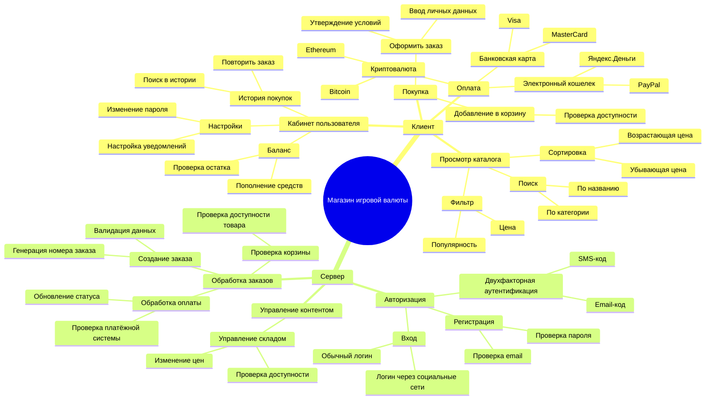
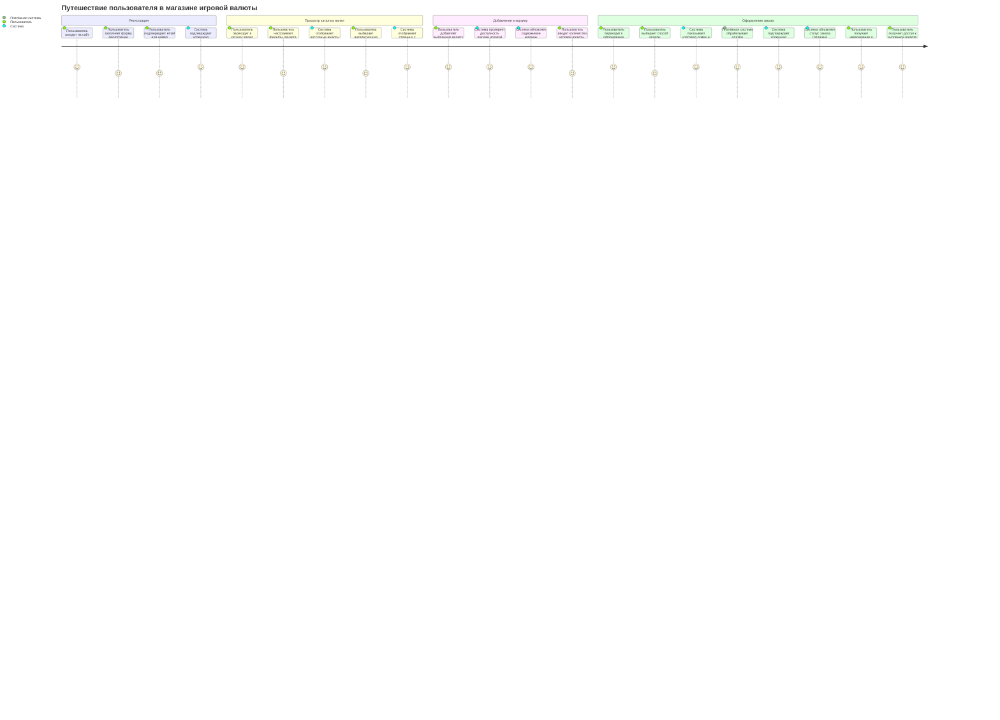
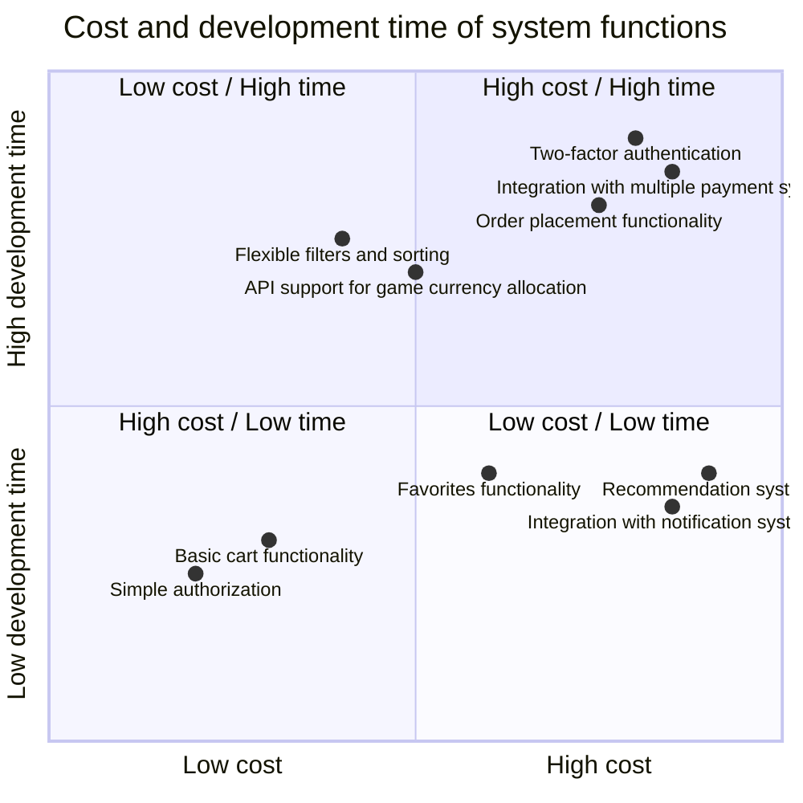
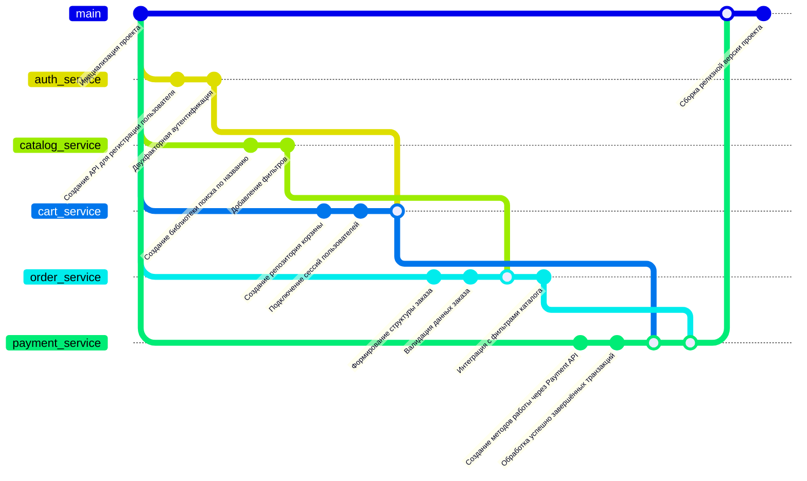

# KPSS

# Диаграммы для проекта "Магазин игровой валюты"

## 1. Структура функциональных возможностей (Mind Map)

Данная диаграмма представляет структуру и ключевые особенности системы магазина, реализующего покупку, хранение и учет игровой валюты. Она содержит основные сущности и функции, которые разделены логически на две большие ветви: **Клиент** и **Сервер*. Каждая из ветвей детализирует действия или процессы, которые проходят пользователи и серверная часть системы.

---

**Связь диаграммы с системой магазина игровой валюты:**

**1. Клиентская сторона** - это взаимодействие конечных пользователей с магазином через интерфейс (веб-сайта или приложения):
   - **Оплата:** Предоставлены все возможные методы добавления денег для покупки игровой валюты. Это включает использование стандартных методов (банковские карты), электронных платежей, а также криптовалюты. Разнообразие вариантов упрощает работу с различными аудиториями.
   - **Просмотр каталога:** Это система фильтрации и поиска игровых товаров, которая позволяет покупателям с легкостью находить нужную продукцию. Возможности сортировки ускоряют процесс работы с лотами.
   - **Покупка:** Реализован стандартный процесс добавления товаров в корзину (где обязательно осуществляется проверка наличия) и оформление заказа с заполнением обязательных данных.
   - **Кабинет пользователя:** Личный кабинет — это инструмент самообслуживания и управления учетной записью. Он включает историю покупок, управление балансом (например, проверка средств), и возможность повторения заказов.

**2. Сервера:**
   - **Авторизация:** Включает регистрацию и вход (с двумя уровнями — обычный логин или через социальные сети). Меры безопасности, такие как двухфакторная аутентификация, обеспечивают защиту учетной записи.
   - **Управление контентом:** Магазинный сервер обрабатывает складские данные о доступности товаров и ценах в реальном времени.
   - **Обработка заказов:** Сервер занимается проверкой корзины, созданием заказа и обработкой платежей через различные методы. Здесь важным аспектом является контроль валидации данных и генерация уникального номера каждого заказа.

---

**Связь функциональных процессов с особенностями магазина игровой валюты:**

- Интеграция с разными методами оплаты удобна для международных пользователей — в том числе для игроков, использующих криптовалюту.
- Гибкая система поиска, фильтрации и сортировки позволяет клиентам быстро находить игровые товары или валюту, которые им необходимы.
- Личный кабинет помогает пользователям эффективно контролировать свой игровой баланс и историю транзакций.
- Серверная часть отвечает за высокий уровень безопасности (многоступенчатая авторизация) и точность обработки платежей, что особенно важно в условиях экономической значимости трансакций игровой валюты.

---

## 2. Диаграмма путешествия пользователя (User Journey Diagram)

Диаграмма описывает путь пользователя (User Journey) в процессе работы с магазином игровой валюты. Она фокусируется на последовательности действий, от момента регистрации до получения купленных единиц валюты. Каждое действие указано для двух сторон: Пользователя и Системы.

---

Описание путей и их связь с системой магазина игровой валюты:

### 1. Регистрация
   Этот этап описывает начальный вход нового пользователя в экосистему магазина. Регистрация требуется для создания учетной записи, гарантирующей дальнейшую персонализацию.
   - Что делает пользователь? Пользователь заполняет форму на сайте и подтверждает свою учетную запись через email или номер телефона.
   - Что делает система? 
     - Генерирует запись в базе и проверяет данные.
     - Отправляет письмо или SMS с подтверждением.
   
   Зачем это нужно?
   Этот процесс обеспечивает доступ пользователя к магазину, при этом безопасность и уникальность данных проверяет система.

---

### 2. Просмотр каталога валют
   В этом этапе пользователь взаимодействует с каталогом магазина для подбора подходящей игровой валюты.
   - Что делает пользователь? 
     - Открывает каталог и настраивает фильтры по интересующим параметрам (игра, валюта, цена).
     - Из большого списка доступных позиций он выбирает подходящий вариант.
   - Что делает система?
     - Обрабатывает запрос пользователя и отображает позиции, удовлетворяющие заданным фильтрам.
     - Предоставляет информацию и характеристики выбранной валюты на отдельной странице.

   Зачем это нужно?
   Удобная фильтрация и просмотр валют помогает пользователю быстро найти нужный продукт, что положительно сказывается на пользовательском опыте.

---

### 3. Добавление в корзину
   На этом этапе пользователь формирует список товаров, которые хочет приобрести.
   - Что делает пользователь? 
     - Добавляет в корзину выбранную игровую валюту.
     - Устанавливает количество валюты, которое собирается купить.
   - Что делает система?
     - Проверяет наличие валюты и возможность её приобретения.
     - Обновляет корзину с учетом введенного количества и цены.

   Зачем это нужно?
   Корзина предоставляет удобный инструмент для управления покупками, а проверка доступности позволяет избежать ошибок оформления.

---

### 4. Оформление заказа
   Этот этап описывает заключительную часть покупки.
   - Что делает пользователь?
     - Выбирает способ оплаты (например, карта, электронный кошелек, криптовалюта).
     - Подтверждает свою готовность оплатить товар.
   - Что делает система?
     - Передает данные о заказе в платежную систему для обработки.
     - Получает подтверждение платежа от платежной системы.
     - Обновляет статус заказа на "оплачен".
     - Отправляет уведомление пользователю о выполнении покупки.
     - Предоставляет доступ к купленной валюте (например, ключ или инвентарь).

   Зачем это нужно?
   Оформление заказа завершающий этап работы с магазином. Здесь важно обеспечить безопасность транзакции и комфортный процесс покупки.

---

### Как диаграмма связана с системой магазина?
Диаграмма показывает ключевые взаимодействия пользователя с системой магазина игровой валюты, включая регистрацию, просмотр каталога, управление корзиной и оформление покупки. Она подчеркивает автоматизацию процессов, удобство навигации и высокой уровень защиты данных. В целом, этот путь демонстрирует, как структура магазина упрощает процесс покупки для пользователей, делая его максимально прозрачным и надежным.

---

## 3. Квадрант-граф (Приоритизация функций)

Диаграмма квадрантов представляет стоимость и время разработки различных функций системы магазина игровой валюты. Она демонстрирует, как различные функции соотносятся по параметрам затрат и временных ресурсов, необходимых для их реализации.

---

Объяснение диаграммы:

1. Оси:
    - Горизонтальная ось (X): Стоимость разработки (от низкой к высокой).
    - Вертикальная ось (Y): Время разработки (от низкого к высокому).

2. Квадранты:
    - Квадрант 1 (High cost / High time): Функции, которые требуют больших временных и финансовых затрат. Например, это сложные задачи, часто важные для безопасности или интеграции, но реализуемые за долгое время.
    - Квадрант 2 (Low cost / High time): Функции, которые сравнительно дешевы, но занимают значительное время для реализации, часто из-за сложности технической архитектуры.
    - Квадрант 3 (High cost / Low time): Функции, которые требуют значительных финансовых вложений, но могут быть реализованы в короткие сроки.
    - Квадрант 4 (Low cost / Low time): Функции, которые можно быстро и дешево реализовать. Обычно это простые базовые функции.

---

### Описание функций и их места на диаграмме

- 0.8, 0.9 Two-factor authentication (Двухфакторная аутентификация):
   Размещена в Квадранте 1: Эта функция требует высоких затрат (доработка системы безопасности, интеграция 2FA-сервисов) и занимает много времени, так как требует тщательного тестирования.

- 0.85, 0.85 Integration with multiple payment systems (Интеграция с несколькими платёжными системами):
   Также в Квадранте 1: Высокие временные и денежные затраты обусловлены сложностью работы с несколькими API, необходимостью тестирования безопасности и надежности транзакций.

- 0.75, 0.8 Order placement functionality (Функционал оформления заказов):
   В Квадранте 1: Основной функционал магазина, требующий тщательного проектирования, проверки и настройки интеграции с корзиной, платёжной системой и уведомлениями. Затраты высоки и во времени, и в деньгах.

- 0.4, 0.75 Flexible filters and sorting (Гибкие фильтры и сортировка):
   В Квадранте 2: Реализация фильтров может быть достаточно сложной, особенно при большом количестве категорий. Однако это не требует больших финансовых инвестиций.

- 0.5, 0.7 API support for game currency allocation (Поддержка API для распределения валюты):
   В Квадранте 2: Данная опция сравнительно недорогая, но требует времени на тестирование взаимодействия с игровым API и обеспечение надежности.

- 0.9, 0.4 Recommendation system (Система рекомендаций):
   В Квадранте 3: Эффективная система рекомендаций требует серьёзных инвестиций в разработку алгоритмов (например, обучаемые модели данных), однако её можно реализовать относительно быстро на уже существующих методологиях.

- 0.85, 0.35 Integration with notification system (Интеграция с системой уведомлений):
   В Квадранте 3: Интеграция с готовыми сервисами уведомлений (например, email-рассылки) требует финансовых затрат на сервисы, но реализуется быстро.

- 0.6, 0.4 Favorites functionality (Функция "Избранное"):
   В Квадранте 3: Эта функция имеет умеренную стоимость и быстро разрабатывается при парной интеграции с базами данных.

- 0.3, 0.3 Basic cart functionality (Базовая функциональность корзины):
   В Квадранте 4: Простая корзина - основная часть e-commerce систем, легко реализуется на готовых фреймворках, стоит дешево.

- 0.2, 0.25 Simple authorization (Простая авторизация):
   В Квадранте 4: Простая авторизация с использованием email и пароля — это базовый модуль любой системы, который дешев и быстро реализуем.

---

Связь с системой магазина игровой валюты:

- Основные функции (Order placement, Basic cart, Simple authorization): Обеспечивают базовый пользовательский функционал магазина. Эти элементы лежат в основе системы, и их реализация обязательна.

- Второстепенные функции (Favorites, Recommendation system): Добавляют удобство для пользователей, например, предоставляя индивидуализированные сервисы (рекомендации) или возможность быстрого доступа к избранным позициям.

- Интеграции (Payment systems, Notification system, API support): Необходимы для полной работы магазина. Позволяют обрабатывать заказы, взаимодействовать с платёжными системами и поставщиками игрового контента.

- Дополнительная безопасность (Two-factor authentication): Увеличивает доверие пользователей к платформе, защищая их данные и средства от несанкционированного доступа.

Эта диаграмма помогает организовать разработку таким образом, чтобы сначала реализовать базовые и быстро внедряемые функции, а затем работать над более сложными или дорогостоящими улучшениями.
---

## 4. Гит-граф (Gitgraph)

**Диаграмма представляет рабочий процесс разработки системы магазина игровой валюты с использованием системы контроля версий (Git). Она отображает ветвление, независимую реализацию различных модулей и их последующую интеграцию в единое приложение.**

---

### **Объяснение диаграммы:**

1. **Ветвление и модули:**
   - Каждый модуль/функциональный блок системы (например, аутентификация, каталог, корзина) разрабатывается в отдельной ветке (branch), что позволяет изолировать процесс работы над каждым компонентом.
   - После завершения работы над функциональным блоком, этот модуль интегрируется в основную ветку `main` с использованием команды `merge`.

2. **Основная структура:**
   - Ветка `main` представляет итоговую сборку приложения, куда постепенно вносятся изменения по мере завершения разработки отдельных компонентов.
   - Модули взаимодействуют друг с другом через слияние (merge), что позволяет интегрировать функциональные зависимости (например, корзина использует модули авторизации и каталога).

---

### **Описание веток и их содержания:**

1. **main:**
   - Основная ветка проекта. Все изменения из других веток вносятся сюда после успешного тестирования.
   - Финальная версия приложения (`Сборка релизной версии проекта`) формируется именно здесь.

2. **auth_service (Модуль аутентификации):**
   - Включает разработку базового API для регистрации пользователей.
   - Добавляет функцию двухфакторной аутентификации для обеспечения безопасности учетных записей.

   **Связь с системой:**
   - Модуль отвечает за авторизацию пользователей, обеспечивая доступ к личным кабинетам, корзине и оформлению заказов.

3. **catalog_service (Модуль каталога):**
   - Реализует поиск валюты по названию валюты или названию игры.
   - Добавляет фильтры, которые позволяют пользователям сортировать и находить подходящую игровую валюту по заданным критериям.

   **Связь с системой:**
   - Это ключевой модуль для организации ассортимента магазина, обеспечивающий удобный поиск и сортировку игровых валют.

4. **cart_service (Модуль корзины):**
   - Создан репозиторий для управления корзиной (добавление/удаление товаров).
   - Подключены пользовательские сессии для сохранения состояния корзины (даже при повторном входе).
   - Ветка сливается с модулем аутентификации для интеграции функций авторизации.

   **Связь с системой:**
   - Модуль корзины позволяет пользователям собирать товары перед оформлением заказа и взаимодействует с учетными записями.

5. **order_service (Модуль заказов):**
   - Разрабатывается структура заказов, включая необходимые данные (товары, цены, пользователь).
   - Реализована валидация данных заказа.
   - Обеспечена интеграция с фильтрами каталога через слияние соответствующей ветки.

   **Связь с системой:**
   - Этот модуль отвечает за оформление заказов, их проверку и взаимодействие с каталогом для получения данных о товарах.

6. **payment_service (Модуль платежей):**
   - Созданы методы работы с Payment API для обработки реальных платежей.
   - Реализованы функции обработки успешных транзакций (передача данных о покупке).
   - Ветка сливается с модулями `cart_service` и `order_service` для полной интеграции с корзиной и заказами.

   **Связь с системой:**
   - Это критический модуль, выполняющий обработку транзакций и их привязку к заказам, тем самым завершая цикл покупки.

---

### **Связь с системой магазина:**

- **Логика модулей:**
   - Каждый модуль представляет собой самостоятельный функциональный блок, который выполняет конкретную задачу и взаимодействует с другими модулями по мере необходимости.
   - Например, чтобы оформить заказ, система должна использовать данные из модуля аутентификации (идентификация пользователя), каталога (данные товаров), корзины (выбранные товары) и платежей (обработка транзакции).

- **Подход к разработке:**
   - Использование веток Git позволяет нескольким командам разработчиков параллельно работать над различными модулями, минимизируя конфликты и облегчая интеграцию.
   - Последовательное слияние веток в `main` обеспечивает стабильность финальной версии проекта.

- **Сборка финального приложения:**

- На завершающем этапе происходит интеграция всех модулей в финальную версию системы через релизный коммит (Сборка релизной версии проекта), что завершает цикл разработки.

---

Таким образом, подобная диаграмма наглядно демонстрирует, как шаг за шагом разрабатываются различные элементы системы магазина игровой валюты, от аутентификации до платежей, и поэтапно соединяются в единое целое для окончательной сборки приложения.
