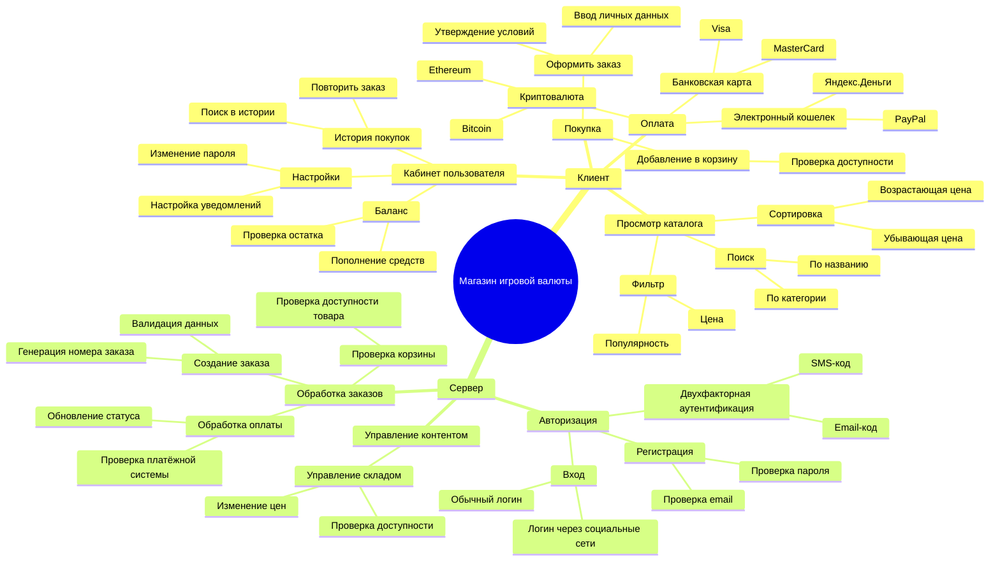
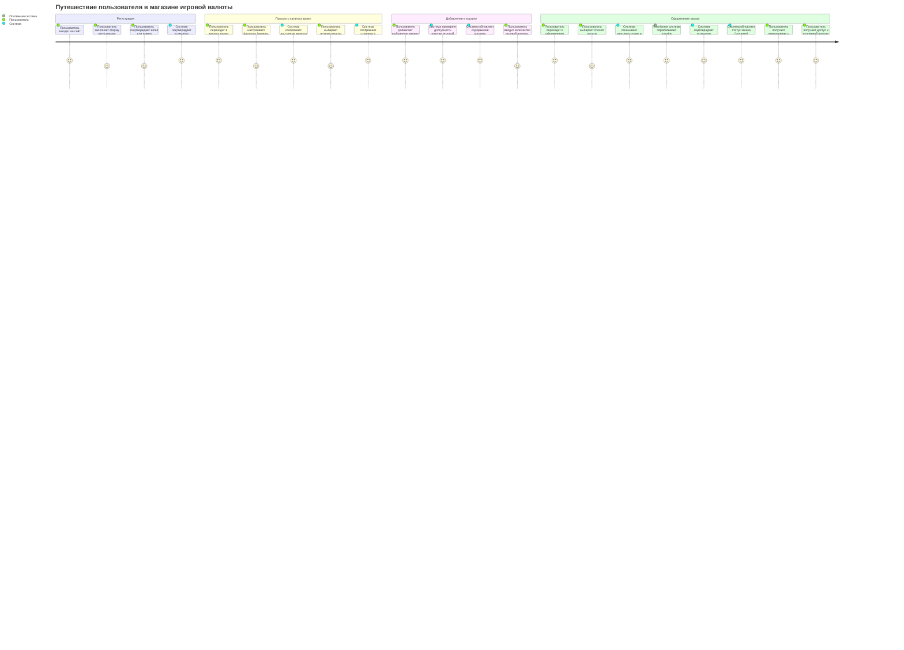
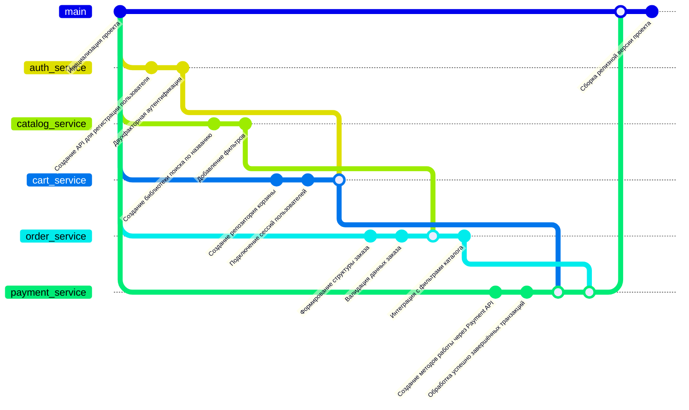

# KPSS
# Диаграммы для проекта "Магазин игровой валюты"

## 1. Структура функциональных возможностей (Mind Map)




---

## 2. Диаграмма путешествия пользователя (User Journey Diagram)



---

## 3. Квадрант-граф (Приоритизация функций)
```mermaid
quadrantChart
  title Подробная приоритизация функций
    x-axis Низкая стоимость --> Высокая стоимость
      y-axis Низкое время --> Высокое время
        quadrant-1 Низкая стоимость / Низкое время
        quadrant-2 Низкая стоимость / Высокое время
        quadrant-3 Высокая стоимость / Низкое время
        quadrant-4 Высокая стоимость / Высокое время
        item1 "Базовая функциональность корзины"
        item2 "Простая авторизация"
        item3 "Гибкие фильтры и сортировка"
        item4 "Поддержка API для партнёрских программ"
        item5 "Система рекомендаций"
        item6 "Интеграция с системой уведомлений"
        item7 "Двухфакторная аутентификация"
        item8 "Интеграция с несколькими платёжными системами"
        item9 "Расширенные аналитические отчеты"
```

---

## 4. Гит-граф (Gitgraph)

